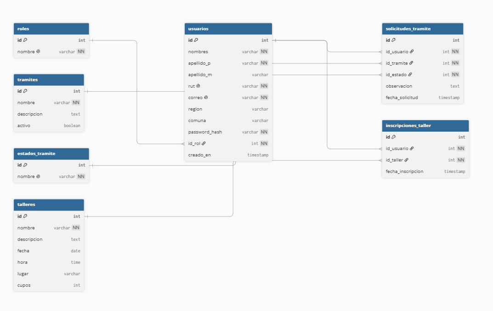
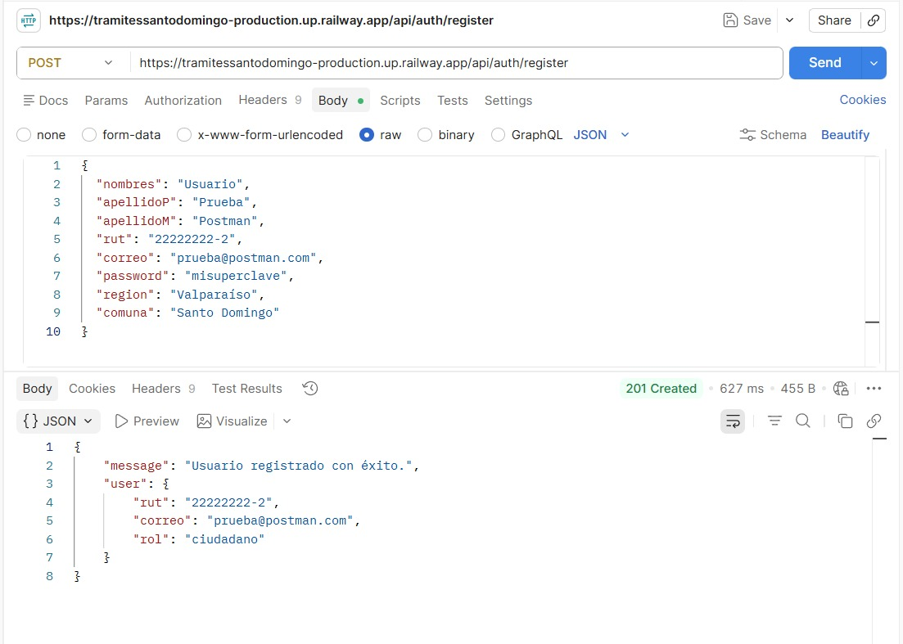
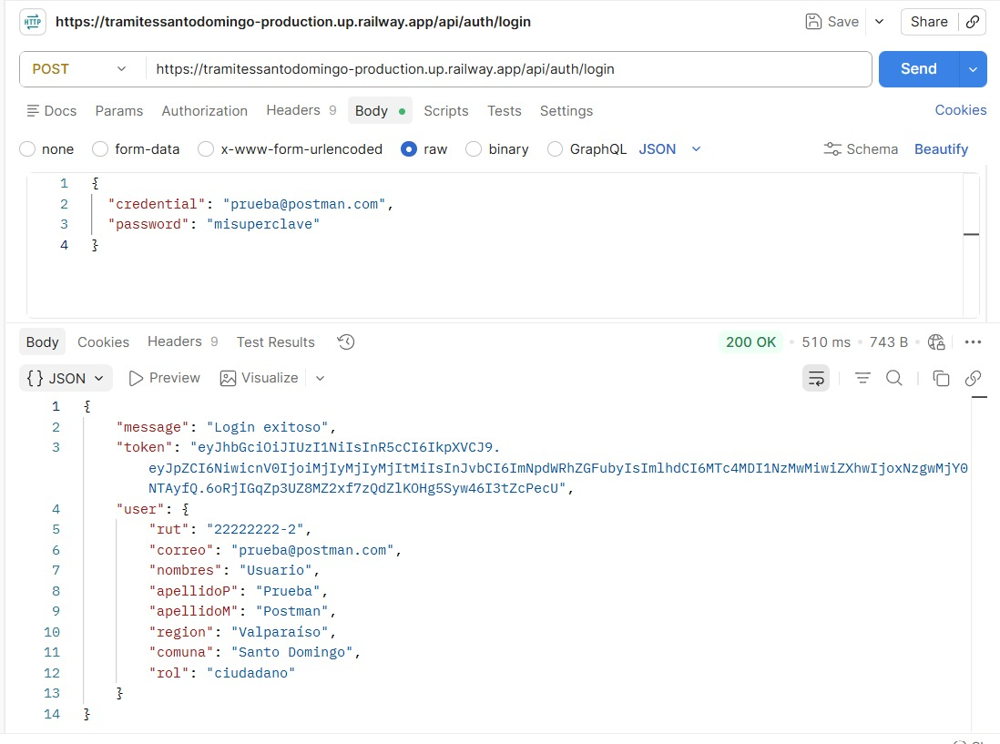
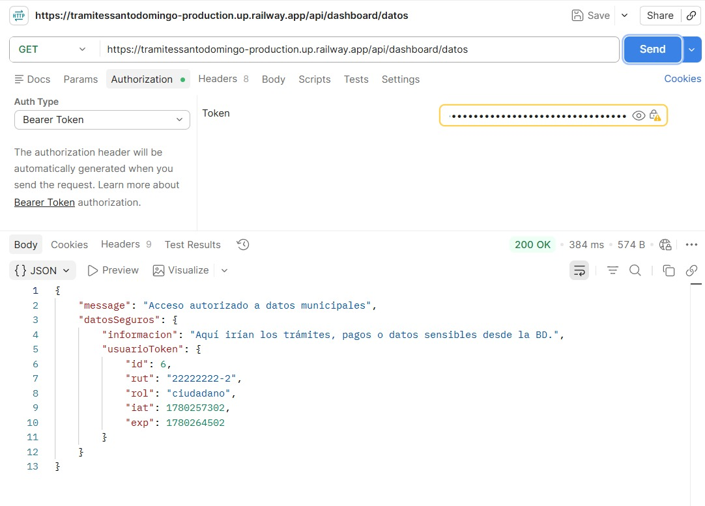

# Proyecto: Sistema de Gestión de Trámites Municipales - Santo Domingo

## 1. Información del Grupo
* **Integrantes:** Fernanda Cádiz, Luciano Fredes, Héctor Fuentes, Diego Escobar
* **Asignatura:** Ingeniería Web y Móvil (ICI 4247-2)
* **Fecha:** Mayo 2026
* **Tecnologías Frontend:** Ionic Framework, React, TypeScript
* **Tecnologías Backend:** Node.js con Express
* **Base de Datos:** MySQL

---

## 2. Definición del Problema y Usuario Objetivo (EP 1.2)

### Justificación
La Municipalidad de Santo Domingo cuenta actualmente con una plataforma de trámites en línea que presenta múltiples deficiencias, como una oferta limitada de servicios, fragmentación entre distintos sitios web, inconsistencias en la ejecución de trámites, problemas de calidad y falta de gestión de perfiles de usuario.

Este proyecto propone el desarrollo de una nueva plataforma web y móvil que centralice y modernice los trámites municipales, permitiendo a ciudadanos y funcionarios realizar gestiones de forma más eficiente. Entre las funcionalidades contempladas se incluyen inscripción a talleres, solicitud de beneficios sociales, obtención de certificados, pago de permisos y multas, además de herramientas de validación y gestión para funcionarios municipales.

La propuesta también incorpora un sistema de perfiles personalizados y bases de datos orientadas a mejorar la experiencia del usuario. Asimismo, el proyecto se alinea con la transformación digital del sector público en Chile y contribuye al cumplimiento de la Ley 21.180, que establece la digitalización total de los organismos públicos para el año 2027.

# Perfiles de Usuario y Funcionalidades

## 1. Ciudadano (Invitado / Residente)

Corresponde a personas mayores de 18 años que utilizan la plataforma para realizar trámites municipales, acceder a servicios comunitarios y efectuar pagos de manera remota mediante dispositivos móviles o computadores.

### Funcionalidades

* **Validación de Residencia:** Permite cargar documentos de respaldo, como comprobantes de domicilio, para solicitar la acreditación como residente de la comuna. Una vez aprobada la solicitud por un funcionario municipal, el usuario obtiene acceso a trámites y beneficios exclusivos para residentes.

* **Inscripción a Programas y Talleres Municipales:** Permite consultar la oferta de talleres y actividades disponibles, revisar su información e inscribirse según la disponibilidad de cupos. El sistema enviará recordatorios automáticos previos al inicio de cada actividad.

* **Gestión de Trámites y Pagos:** Permite solicitar certificados, realizar pagos de permisos de circulación y multas, así como gestionar otros trámites municipales disponibles a través de la plataforma.

* **Agendamiento de Atención Presencial:** Permite reservar horas para trámites que requieren atención presencial, tales como exámenes o renovaciones de licencia de conducir, generando un comprobante digital asociado a la reserva.

* **Seguimiento de Trámites:** Permite consultar el estado e historial de los trámites realizados, visualizando cada etapa del proceso, fechas relevantes y observaciones realizadas por funcionarios municipales.

* **Corrección de Antecedentes Observados:** Permite modificar y reenviar información o documentación cuando un trámite ha sido observado o rechazado por falta de antecedentes, evitando reiniciar completamente el proceso.


## 2. Funcionario Municipal

Corresponde al personal de las distintas unidades municipales encargado de revisar solicitudes, validar documentación, gestionar trámites y mantener la correcta operación de los servicios digitales ofrecidos a la comunidad.

### Funcionalidades

* **Validación de Usuarios:** Permite revisar la documentación presentada por los ciudadanos para acreditar residencia y aprobar o rechazar la solicitud según los criterios definidos por la municipalidad.

* **Gestión de Solicitudes Ciudadanas:** Permite acceder a una bandeja de trabajo donde se visualizan, filtran y administran las solicitudes ingresadas por los ciudadanos, organizadas según el departamento municipal correspondiente.

* **Gestión de Estados de Trámites:** Permite actualizar el estado de los trámites durante su ciclo de vida, registrar observaciones, solicitar correcciones y notificar a los ciudadanos sobre avances o resoluciones.

* **Administración de Talleres y Programas:** Permite gestionar la oferta de talleres municipales, controlar la disponibilidad de cupos y supervisar la participación de los ciudadanos inscritos.

* **Generación de Reportes:** Permite generar y exportar reportes estadísticos relacionados con la gestión municipal, incluyendo cantidad de trámites procesados, tiempos de respuesta, inscripciones y asistencia a talleres, apoyando la toma de decisiones institucionales.

---

## 3. Requerimientos del Proyecto (EP 1.1)

## Requerimientos Funcionales (RF)

| Código | Nombre | Descripción |
|---------|---------|-------------|
| RF-01 | Solicitud y acreditación de Tarjeta Vecino | El sistema permitirá a los ciudadanos cargar documentos de respaldo, tales como boletas de servicios básicos en formato PDF o imagen, para solicitar la acreditación como residente mediante la obtención de la Tarjeta Vecino. La solicitud será revisada por un funcionario municipal, quien podrá aprobar o rechazar la validación. En caso de aprobación, el usuario obtendrá el perfil de Residente Validado y acceso a los servicios y trámites exclusivos para residentes. |
| RF-02 | Bandeja de gestión municipal | El sistema proporcionará a los funcionarios municipales un panel de gestión que permita visualizar, listar, filtrar y administrar las solicitudes ingresadas por los ciudadanos. Las solicitudes estarán organizadas según el departamento municipal correspondiente, tales como Tránsito, DIDECO u Obras Municipales. |
| RF-03 | Seguimiento y trazabilidad de trámites | El sistema permitirá a los ciudadanos consultar el estado y el historial completo de sus trámites mediante una línea de tiempo que muestre cada etapa del proceso, incluyendo fechas, cambios de estado y observaciones realizadas por los funcionarios responsables. |
| RF-04 | El sistema proporcionará un mecanismo de trazabilidad y retroalimentación asíncrona para la evaluación de solicitudes. Cuando un trámite no cumpla con los requisitos, el sistema permitirá al funcionario clasificarlo bajo el estado "Observado" o "Rechazado", habilitando un campo de texto estructurado para ingresar el fundamento técnico. Este dictamen se persistirá en la base de datos y se reflejará en tiempo real en la bandeja del ciudadano, garantizando la transparencia del proceso evaluativo. |
| RF-05 | El sistema permitirá a los ciudadanos reservar, consultar y gestionar horarios para trámites de licencias de conducir mediante una interfaz interactiva. La plataforma controlará la disponibilidad de los bloques horarios, impidiendo la duplicidad de reservas. Una vez confirmada la operación, se generará un registro digital inmutable que quedará anclado al historial del usuario, permitiendo su consulta continua y ofreciendo la capacidad de anular la reserva para liberar el cupo en el sistema. |
| RF-06 | El sistema expondrá un catálogo interactivo de talleres comunitarios con control de acceso basado en roles (RBAC), restringiendo la funcionalidad de inscripción de forma exclusiva a los perfiles con estado de Residente Validado. Además, integrará un motor de concurrencia que administrará el inventario de cupos en tiempo real, procesando altas y bajas dinámicamente y bloqueando nuevas transacciones de manera automática cuando se alcance el aforo máximo definido para el taller. |
| RF-07 | Generación de reportes de gestión | El sistema permitirá a los funcionarios municipales generar y exportar reportes estadísticos relacionados con la gestión municipal, incluyendo indicadores como la cantidad de trámites procesados, tiempos de respuesta y niveles de participación en talleres, con el fin de apoyar la toma de decisiones. |

## Relación entre Roles y Requerimientos funcionales

| Requerimiento | Ciudadano | Funcionario |
|--------------|-----------|------------|
| RF-01 | ✓ | ✓ |
| RF-02 |   | ✓ |
| RF-03 | ✓ |   |
| RF-04 | ✓ | ✓ |
| RF-05 | ✓ |   |
| RF-06 | ✓ | ✓ |
| RF-07 |   | ✓ |

## Requerimientos No Funcionales (RNF)

| Código | Nombre | Descripción |
|---------|---------|-------------|
| RNF-01 | Usabilidad y Responsividad | La plataforma deberá ser accesible desde dispositivos móviles y computadores, adaptando automáticamente la interfaz a distintos tamaños de pantalla mediante diseño responsivo. |
| RNF-02 | Rendimiento | El sistema deberá responder a las consultas y operaciones principales en un tiempo máximo de 3 segundos bajo condiciones normales de uso. |
| RNF-03 | Seguridad | El acceso a las funcionalidades protegidas deberá realizarse mediante autenticación basada en JWT, y las contraseñas de los usuarios deberán almacenarse utilizando algoritmos de cifrado seguros como bcrypt. |
| RNF-04 | Compatibilidad | El sistema deberá funcionar correctamente en las versiones más recientes de los navegadores Google Chrome, Microsoft Edge y Mozilla Firefox. |

## 4. Diseño UI/UX (EP 1.3)
Se han diseñado 7 mockups diferenciados para versiones móvil y web, considerando una jerarquía visual clara y navegación adaptativa.

* **Prototipo en Figma:** [Acceder al Prototipo](https://www.figma.com/design/2x3lhSDr8Qh3J415n52FCj/Sin-t%C3%ADtulo?node-id=0-1&t=lk1vlgy2RKpvECyH-1)

## 5. Arquitectura de Navegación y UX (EP 1.4)

### Mapa de Rutas
* **Públicas:** `/login`, `/registro`, `/tramites`.
* **Protegidas (Ciudadano):** `/profile`, `/mis-tramites`, `/mis-agendas`, `/dideco`.
* **Protegidas (Funcionario):** `/admin-dashboard`, `/Generar-reportes`, `/tramites-asignados`, `/Confirmaciones-de-Residencia`.

### Estrategia de Experiencia de Usuario (UX)
Siguiendo los principios de usabilidad de la cátedra, el diseño contempla:
* **Claridad y Control:** Acciones principales visibles y manejo de estados vacíos útiles.
* **Carga Cognitiva Mínima:** Tareas divididas por pantallas y copy conciso.
* **Apoyo:** Micro-feedback inmediato ante errores o éxito en la carga de archivos.

### Flujos de Tarea (Task Flows)
1. **Inscripción a Taller:** Login -> Trámites -> DIDECO -> Detalle Taller -> Formulario -> Confirmacion Via Correo.
2. **Agendar Trámite:** Login -> Trámites Presenciales -> Ver disponibilidad -> Seleccionar hora -> Confirmar.
3. **Validación Residencia:** Perfil -> Subir documento -> Revisión Admin -> Aprobación -> Cambio a Rol Residente.

<div align="center">
  
</div>

<div align="center">
  
</div>

---

## 6. Gestión del Proyecto
El desarrollo se gestiona íntegramente mediante herramientas de GitHub:
* **GitHub Projects:** Tablero Kanban para el seguimiento de tareas en tiempo real.
* **GitHub Issues:** Registro detallado de cada requerimiento funcional con sus criterios de aceptación.

---

## 7. Desarrollo del Backend y Base de Datos (Entrega Parcial 2)

Durante la segunda etapa del proyecto, se construyó e integró el servidor Backend con el Frontend de la aplicación, cumpliendo con los siguientes hitos técnicos:

* **Servidor y API REST (EP 2.1, 2.3 y 2.4):** Se levantó el entorno backend utilizando **Node.js y Express**, desarrollando los endpoints necesarios (GET, POST) manejando respuestas en formato JSON estructurado. Esta API fue conectada con éxito al frontend desarrollado en Ionic con React.

* **Base de Datos (EP 2.2):** Se creó una base de datos relacional en **MySQL**. A continuación, se presenta el Modelo Relacional diseñado para la persistencia de datos del sistema municipal:

<div align="center">
  
</div>

* **Seguridad y Autenticación (EP 2.5 y 2.6):** Se implementó un sistema de seguridad. El registro y login generan y validan **JWT (JSON Web Tokens)** para proteger las rutas privadas y diferenciar roles (Ciudadano vs Funcionario). Además, las contraseñas de los usuarios son encriptadas utilizando **bcrypt** antes de almacenarse en la base de datos para prevenir vulnerabilidades.

* **Documentación de la API (Punto 2.7)**
A continuación se detallan los principales endpoints de la API RESTful implementada, probados mediante Postman/Insomnia.

| Método | Endpoint | Descripción | Request (Body / Headers) | Respuestas HTTP |
|---|---|---|---|---|
| `GET` | `/api` | Verifica el estado del servidor. | *Ninguno* | `200 OK` |
| `POST` | `/api/auth/register` | Crea un nuevo usuario y encripta su contraseña con bcrypt. | **Body:** `{ "rut": "...", "nombres": "...", "apellidoP": "...", "apellidoM": "...", "correo": "...", "password": "...", "region": "...", "comuna": "..." }` | `201 Created`, `400 Bad Request`, `500 Internal Server Error` |
| `POST` | `/api/auth/login` | Valida credenciales (RUT o correo) y genera el token JWT. | **Body:** `{ "credential": "...", "password": "..." }` | `200 OK`, `400 Bad Request`, `401 Unauthorized`, `500 Internal Server Error` |
| `GET` | `/api/dashboard/datos` | Ruta protegida de prueba para acceder a datos municipales. | **Headers:** `Authorization: Bearer <tu_token_jwt>` | `200 OK`, `401 Unauthorized`, `403 Forbidden` |

### Evidencia de Pruebas Funcionales (Postman)

**Registro de Usuario (POST):** Se envía una petición al endpoint `/api/auth/register` adjuntando los datos del ciudadano en el cuerpo (JSON). El servidor responde con un código `201 Created`, confirmando la creación exitosa del registro en la base de datos con su contraseña encriptada.
<div align="center">
  
</div>
<br>

**Autenticación y Generación de JWT (POST):** Se realiza una petición al endpoint `/api/auth/login` con las credenciales del usuario recién creado. El sistema valida la información y devuelve un código `200 OK` junto con el Token JWT asignado para mantener la sesión segura.
<div align="center">
  
</div>
<br>

**Acceso a Ruta Privada (GET):** Se ejecuta una consulta al endpoint protegido `/api/dashboard/datos`, enviando el Token JWT en la cabecera de autorización (Bearer Token). El servidor devuelve un `200 OK` y el mensaje de acceso autorizado, demostrando la validación correcta del middleware de seguridad.
<div align="center">
  
</div>

---

## 8. Instrucciones de Ejecución
Para visualizar y probar el proyecto correctamente en su entorno local, siga estos pasos:

### 1. Requisitos Previos
* **Node.js**: Asegúrese de tener instalado.
* **Ionic CLI**: Recomendado para una mejor gestión del servidor.

### 2. Inicie el backend via terminal
```bash
Ejecute el comando
"cd backend"
en la terminal para que esta se diriga al backend

Una vez alli ingrese el comando
"npm install & npm run dev"
Tras esto se instalaran las depencias y se ejecutara el backend

```

### 3. Inicie el servidor de desarrollo local con el siguiente comando:
```bash
Abra una nueva terminal para salir de la seccion de backend

En la nueva terminal ejecute el comando
"npm install & npm run dev"
Tras esto la pagina deberia comenzar a ejecutarse
```
### 4. Credenciales
En este punto ya deberia encontrarse en la pantalla principal de tramites, como podra darse cuenta en la esquina superior derecha
podra realizar los respectivos inicios de sesion, para ello podra usar las siguientes credenciales o bien registrarse si asi
lo desea.

Inicio de sesion (Normal)
Recomendamos Crear una nueva cuenta usando la funcion de registro

Inicio de sesion Funcionario
Email: admin@municipalidad.cl
Contraseña: admin123

Además, si se desea revisar la base de datos directamente, puede conectarse usando TablePlus o DBeaver con las siguientes credenciales:

Host:     zephyr.proxy.rlwy.net

Port:     49825

User:     root

Password: yzbXDSfWnEhClCrhJSSTLBlecYxwMqeA

Database: 

### 5. Importante
Cabe destacar que multiples de las funciones pensadas para la pagina aun no han sido implementadas, por ello a aquellas paginas que
no estan listas se les ha incorporado un mensaje de error.
